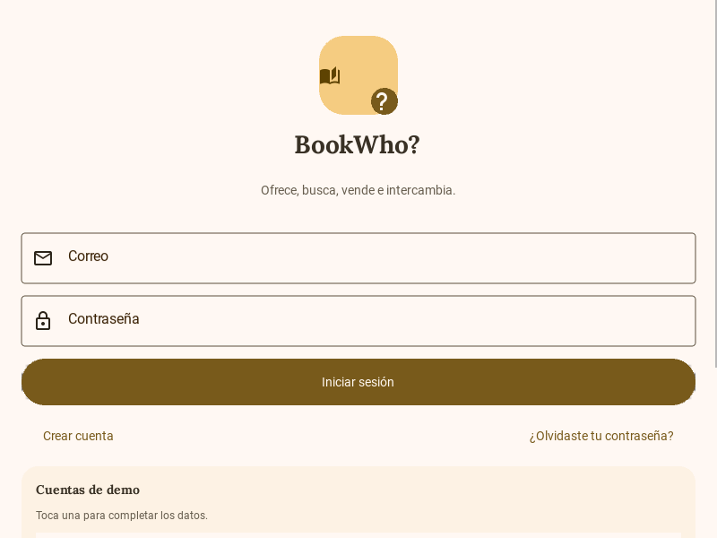
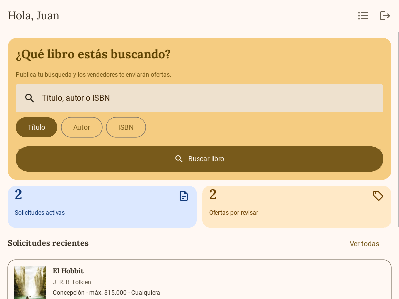
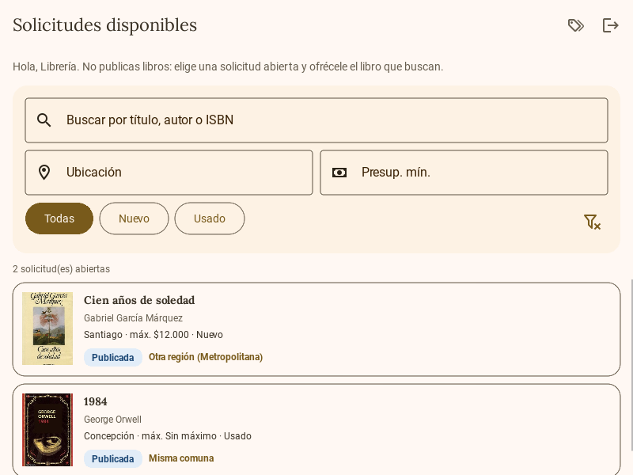
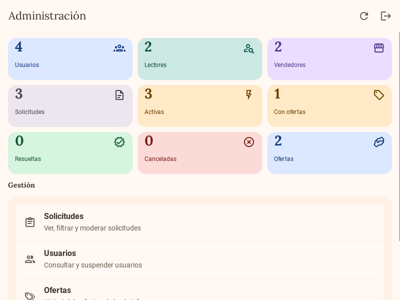

# BookWho? — demo MVP (KivyMD)

## Problema que resuelve

Encontrar un libro específico (agotado, descatalogado, de segunda mano o simplemente difícil
de ubicar) obliga hoy a recorrer varias tiendas o grupos de compraventa sin ninguna garantía
de encontrarlo. **BookWho?** invierte el modelo: el lector publica qué libro busca y son los
vendedores quienes responden si lo tienen, en vez de que el lector tenga que revisar catálogo
por catálogo.

## Usuario objetivo

- **Lectores** que buscan un libro puntual (para regalo, colección, estudio) y no quieren
  perder tiempo comparando tienda por tienda.
- **Vendedores** (librerías pequeñas o personas particulares) que quieren vender libros
  puntuales sin mantener ni actualizar un catálogo público.

Demo navegable del circuito completo descrito en `AGENTS.md`:

```text
Buscar libro -> crear solicitud -> publicar -> vendedor encuentra solicitud
-> crea oferta -> lector acepta -> ve datos de contacto
```

Incluye además la experiencia de administrador (estadísticas, usuarios, solicitudes, ofertas, moderación y actividad).

> **¿Recién clonas el repo?** Lee primero [`CONTEXTO.md`](CONTEXTO.md) (estado del proyecto y cómo trabajar en equipo) y [`AGENTS.md`](AGENTS.md) (visión y reglas del producto). Si usas IA, [`CLAUDE.md`](CLAUDE.md) tiene las instrucciones para el asistente, y [`uso_ia.md`](uso_ia.md) registra su uso real en este proyecto.

## Capturas

| Login | Inicio (lector) |
|---|---|
|  |  |

| Inicio (vendedor) | Administración |
|---|---|
|  |  |

## Requisitos

- Python 3.10 o 3.11
- Kivy 2.3.1 + KivyMD 2.0.1.dev0 (rama master)

```bash
py -3.11 -m venv .venv          # o: uv venv .venv --python 3.11
.venv\Scripts\activate
pip install -r requirements.txt
python main.py
```

## Cuentas de demo (hardcodeadas)

| Rol           | Correo             | Contraseña |
|---------------|--------------------|------------|
| Lector        | lector@demo.cl     | 1234       |
| Lector        | maria@demo.cl      | 1234       |
| Vendedor      | vendedor@demo.cl   | 1234       |
| Vendedor      | pedro@demo.cl      | 1234       |
| Administrador | admin@demo.cl      | admin      |

También puedes registrar nuevas cuentas de lector o vendedor desde la app.

**Sin base de datos:** todo vive en memoria mientras la app está abierta. Al cerrarla, los datos vuelven al estado inicial.

## Estructura

| Archivo              | Contenido |
|----------------------|-----------|
| `main.py`            | App, pantallas, navegación y widgets reutilizables |
| `libros.kv`          | Toda la interfaz y el estilo (KV language) |
| `store.py`           | Entidades, máquinas de estado, reglas de negocio y permisos; repositorio en memoria y datos de ejemplo |
| `books_api.py`       | Búsqueda de libros: Google Books, luego Open Library y, sin conexión, un catálogo local |
| `tests/test_store.py`| Pruebas del flujo crítico, validaciones y permisos |

```bash
python -m unittest discover -s tests -v
```

Opcional: define `GOOGLE_BOOKS_API_KEY` para usar Google Books. Sin clave, Google suele responder 429 y la app usa Open Library.

## Decisiones tomadas para el demo (pendientes de spec, ver AGENTS.md §19)

- Al aceptar una oferta, la solicitud pasa a `RESUELTA` y las demás ofertas activas a `RECHAZADA`. Solo se acepta una oferta por solicitud.
- Los datos de contacto del vendedor solo son visibles tras la aceptación.
- Cancelar una solicitud cancela sus ofertas activas.
- Un vendedor solo puede tener una oferta activa por solicitud, y el estado del libro ofrecido (nuevo/usado) debe ser compatible con lo que acepta el lector.
- Si un vendedor cancela su oferta, la solicitud se mantiene en `CON_OFERTAS`, porque la máquina de estados no define la vuelta a `PUBLICADA`.
- Una cuenta tiene un solo rol. Los usuarios suspendidos no pueden iniciar sesión ni operar.
- "Recuperar contraseña" es simulado: no se envían correos.
- Los reportes y la auditoría formal quedan fuera; el panel de admin muestra un registro de actividad simple.
